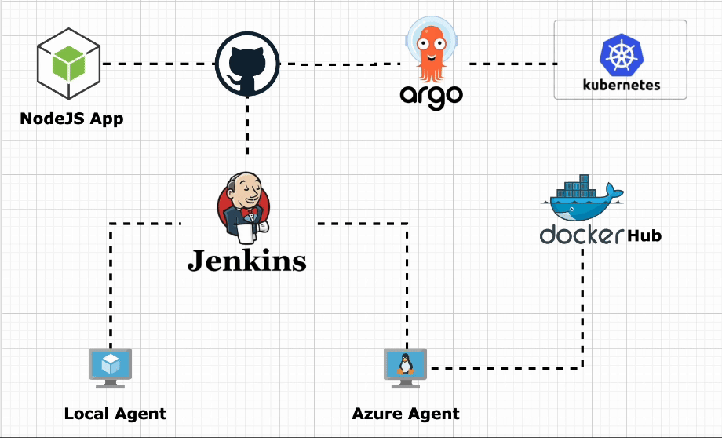
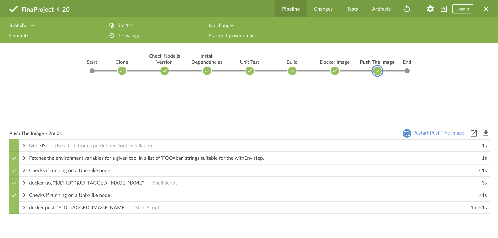
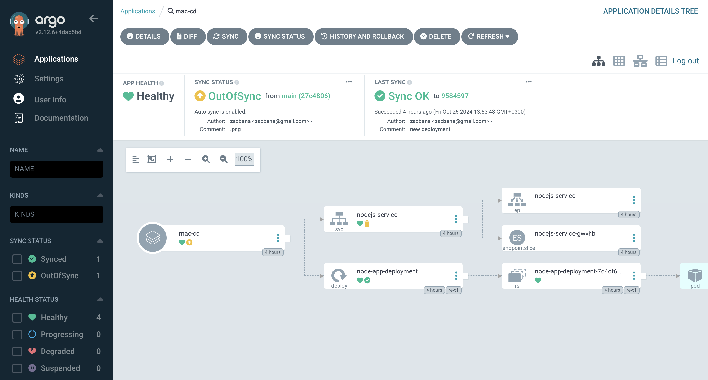
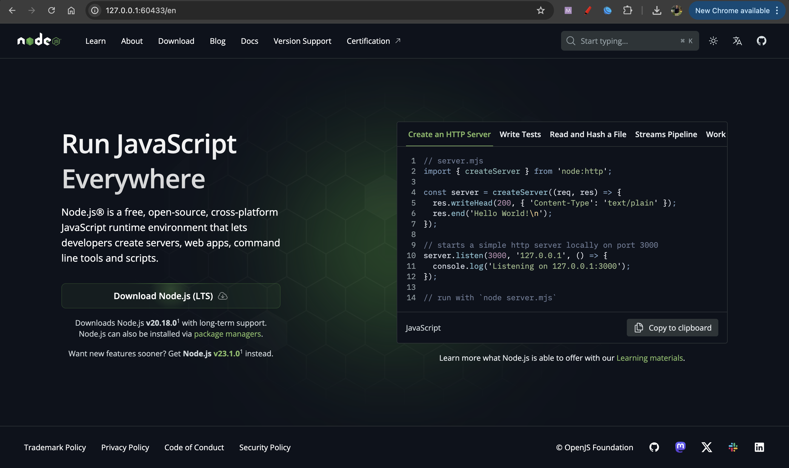

# Orange Final CI/CD Project

<div style="display: flex; justify-content: center; align-items: center; flex-wrap: wrap;">
  
  
  
  
  
  
  
</div>



## Overview
This project involves deploying a Node.js application from the Node.js GitHub repository to a local Kubernetes cluster. We will use ArgoCD for continuous delivery and set up a Jenkins pipeline to automate the build and deployment process.

## Prerequisites
- Virtual Machine (VM) for Jenkins
- Docker installed on the Jenkins VM
- Another VM for Minikube and kubectl
- Minikube installed on the second VM
- ArgoCD installed on Minikube
- Jenkins installed on the first VM
- GitHub account
- Docker Hub account

## Part 1: Jenkins Setup and Dockerization

### Step 1: Fork the Repository
- fork the : https://github.com/nodejs/nodejs.org.git

### Step 2: Set Up Jenkins Pipeline
- Configure a Jenkins pipeline to automate the previous steps. Include a stage to push your Docker image to Docker Hub.

- Create a Jenkinsfile in the root of your repository with the following content:
```
pipeline {
    agent { label 'built-in' }
    tools {
        nodejs 'NodeJS'
    }
    stages {
        stage('Clone') {
            steps {
                git branch: 'main', url: 'https://github.com/zscbana/nodejs.org'
            }
        }
        stage('Check Node.js Version') {
            steps {
                sh 'node -v'
                sh 'npm -v'
            }
        }
        stage('Install Dependencies') {
            steps {
                sh 'npm install'
            }
        }
        stage('Unit Test') {
            steps {
                sh 'npm test'
            }
        }
        stage('Build') {
            steps {
                sh 'npm run build'
            }
        }
        stage('Docker Image') {
            agent {
                label 'AzureAgent'
            }
            steps {
                script {
                    git branch: 'main', url: 'https://github.com/zscbana/nodejs.org'
                    app = docker.build("omarbanna/orange:latest")
                }
            }
        }
        stage('Push The Image') {
            agent {
                label 'AzureAgent'
            }
            steps {
                script {
                    docker.withRegistry('https://index.docker.io/v1/', 'DockerHub') {
                        app.push()
                    }
                }
            }
        }
    }
}
```
- **Node.js 18**: Employed to install dependencies, run tests, and build the Node.js application.
- **Built-in Local**: Used for cloning the repository, installing dependencies, running unit tests, and building the application.
- **Azure Agent (Ubuntu VM)**: Utilized to clone the repository, build the Dockerfile, and push the image to the Docker Hub registry.

## Docker Hub

You can view the Docker image at: [Docker Hub - Omar Banna](https://hub.docker.com/r/omarbanna/orange)

## Screenshots



# Part 2: Deploy the Node.js App to Kubernetes using ArgoCD

## Prerequisites
- ArgoCD installed on Minikube.
- A cluster created in ArgoCD.

## Steps to Deploy

1. **Add Repository**  
   Add the repository link to the ArgoCD `Settings > Repositories`.

2. **Create Automation Application**  
   Create an application named `mac-cd` with automatic sync enabled.

3. **Deployment Configuration**  
   In the `macmini/` path, create a `deployment.yaml` file with the following configuration to set up a deployment with 1 replica using the same image from the Jenkins CI process:

  ```yaml
   apiVersion: apps/v1
   kind: Deployment
   metadata:
     name: node-app-deployment
     namespace: webapp
     labels: 
       app: myapp
       type: nodejs
   spec:
     selector:
       matchLabels:
         app: myapp
     replicas: 1
     template:
       metadata:
         labels:
           app: myapp
       spec:
         containers:
           - name: nodejs
             image: omarbanna/orange
             ports:
               - containerPort: 3000
```
- Expose the Deployment
Expose the deployment on port 3000 as a NodePort service.

- Get Service URL
Retrieve the service URL.


# Final Step
- check argo application


- visit  the website


# Areas for Improvement

- **Enhance Repository Security**  
  Implement security best practices for repository access and management.

- **Adopt GitOps Practices**  
  Utilize GitOps to streamline deployment processes and improve version control.

- **Increase Replicas and Services**  
  Scale the application by increasing the number of replicas and setting up additional services for better performance and reliability.

- **Host on AKS or EKS**  
  Consider deploying the application on Azure Kubernetes Service (AKS) or Amazon Elastic Kubernetes Service (EKS) for cloud hosting.

## Suggestions for Enhancements
Feel free to adjust any sections or add more details as needed!
